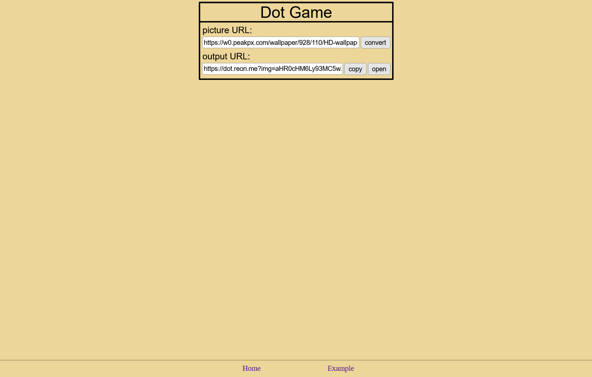
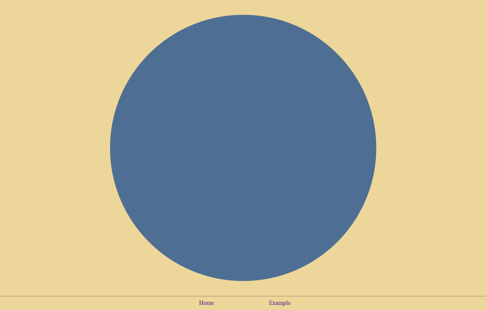
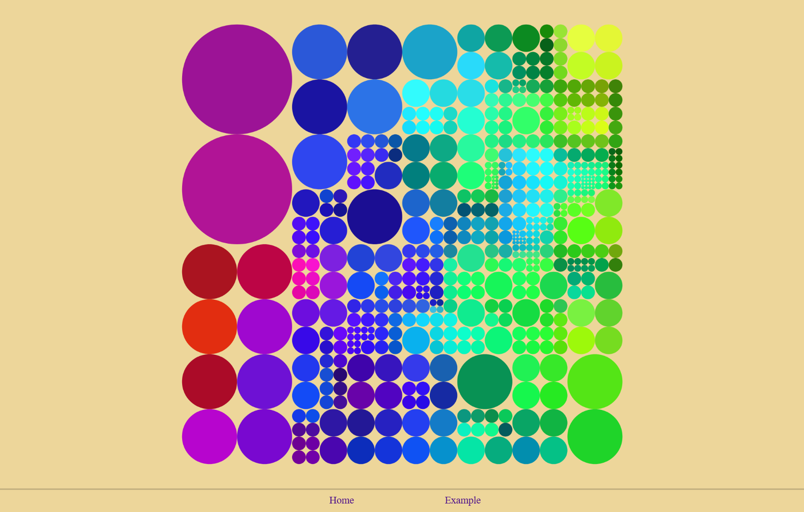

# dot-game
[](https://github.com/reon04/dot-game/actions/workflows/release.yml)

A browser-based 'game' in which an image is initially reduced to a single dot. As the user swipes across the screen in a motion similar to scratching a scratch card, the dot progressively fragments into increasingly smaller dots that gradually reveal the original image.

### Example Deployment

Deploy the container using docker compose:

```
services:
  dot-game:
    container_name: dot-game
    image: "ghcr.io/reon04/dot-game:latest"
    restart: unless-stopped
    environment:
      CORS_PROXY_URL: ""
    ports:
      - "80:80"  
```

Optionally, a CORS proxy can be used to load images from arbitrary external websites. This can help bypass cross-origin restrictions imposed by browsers when the target server does not provide the required CORS headers. A simple CORS proxy can be found [here](https://github.com/reon04/cors-proxy).

### Environment Variables

Env  | Default | Description
---- | ------- | -----------
CORS_PROXY_URL | | If set, the images are loaded using the CORS proxy at the specified proxy URL.

### Example Screenshots




## LICENSE

This project is licensed under [MIT](LICENSE).